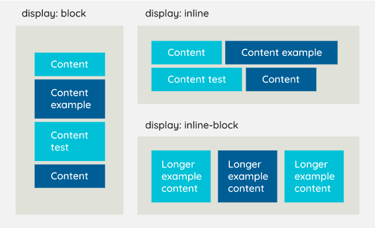
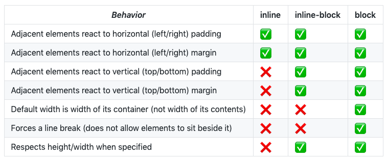
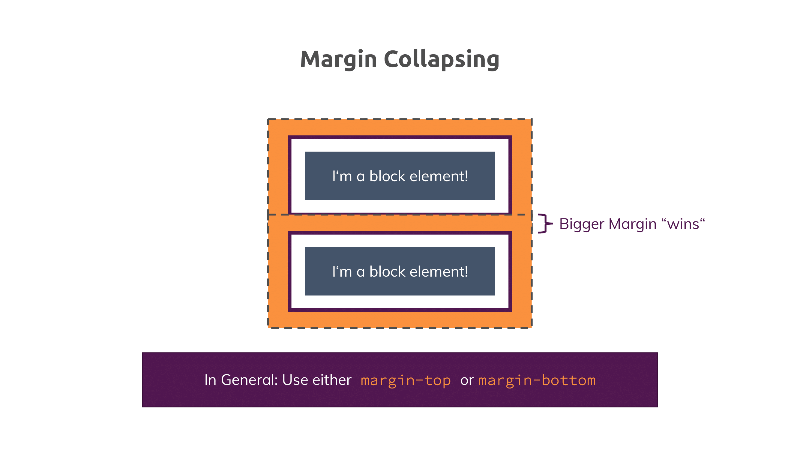

# CSS:

### 1) Basics:
   - **HTML types:**
     - **block:**  
       <ins>Features:</ins> displays in column and has height and width values;
       <ins>HTML elements:</ins> div, h1, p, li, section...
       
     - **inline:**  
       <ins>Features:</ins> doesn't have width and height properties and displays in row;  
       <ins>HTML elements:</ins> span, a, img, em, strong, i, small...
       
     - **inline-block:**  
       <ins>Features:</ins> displays in row and can be set height and width values;
       
     [](images/1_9q32zSfXvoNinOjySTFCZQ.png)
     [](images/zjm7L.png)
     
   - **selectors:**  
     - <ins>elements</ins> (HTML tags)
        ```css
        h1 {
        
        }
        ```
     - <ins>classes</ins> (many tags can have same class name)
       ```css
       .class-name {
       
       }
       ```
     - <ins>IDs</ins> (unique per tag)
       ```css
       #id {
       
       }
       ```
     - <ins>universal</ins> (accept styles to all elements)
       ```css
       * {
       
       }
       ```
     - <ins>attributes</ins> (HTML attributes of tag)
       ```css
       [disabled] {
       
       }
       ```
   - **cascading:**
     - <ins>order of same selectors in one file:</ins>
         ```css
        h1 {
            color: red;
        }
       
        h1 {
            color: blue;
        } /* main priority (overwrites red by blue) */
        ```
     - <ins>selector priorities:</ins>
        1. `*` universal:
           ```css
             * {
               color: black;
             } /* lowest priority */
           ```
        2. `**` elements (HTML tags):  
           ```css
             h1 {
                color: red;
             } /* higher priority (overwrites black by red) */
           ```
        3. `***` classes:  
           ```css
             .class-name {
                color: blue;
             } /* higher priority (overwrites red by blue) */
           ```
        4. `****` IDs:  
           ```css
             #id-name {
                color: green;
             } /* higher priority (overwrites blue by green) */
           ```
       5. `*****` combinators:
          ```css
            .class-name h2 {
               color: yellow;
            } /* higher priority (overwrites blue by yellow) */
          ```
        6. `******` Inline style:  
            ```html
              <div style='color: pink'/> <!-- higher priority (overwrites yellow by pink) -->
            ```
        7. `********` Special word `!important`:  
            ```css
             h1 {
                color: red !important;
             }  /* highest priority (overwrites grey by red) */
           ```
            
   - **combinators:**
     - `selector + selector + ...` (add style to the below sibling):  
       HTML:
          ```html
            <div class="one">1</div>
            <div class="two">2</div>
            <div class="three">3</div> // apply "color: red;" style
          ```
       CSS:
          ```css
             .one + .two + .three {
                color: red;
             }
          ```
     - `selector ~ selector` (add style to the general below sibling):  
       HTML:
          ```html
            <div class="one">1</div>
            <div class="two">2</div>
            <div class="three">3</div> // apply "color: red;" style
          ```
       CSS:
          ```css
             .one ~ .three {
                color: red;
             }
          ```
     - `selector > selector > ...` (add style to the child element):  
       HTML:
          ```html
              <div class="one">
                <div class="two">
                    <div class="three">3</div> // apply "color: red;" style
                </div>
              </div>
          ```
       CSS:
          ```css
             .one > .two > .three {
                color: red;
             }
          ```
     - `selector selector ...`  (add style to the child element):  
       HTML:
          ```html
            <div class="one">
                <div class="two">
                    <div class="three">3</div> // apply "color: red;" style
                </div>
            </div>
          ```
       CSS:
          ```css
             .one .two .three {
                color: red;
             }
          ```
     - `tag.class / tag#id`  (add style to the element that has certain class / id):  
       HTML:
         ```html
            <div class="one">1</div>
         ```
       CSS:
       ```css
         div.one {
          color: red;
         }
       ```
       
   - **positioning:**   
     - <ins>static:</ins>
       Positioning: static position in the document flow;
       
     - <ins>relative:</ins>
       Positioning: relatively the document flow and doesn't drop the element from it;
       Features: top, left, right, bottom;
       
     - <ins>fixed:</ins>  
       Positioning: relatively the viewport and dropping the element from the document flow;
       Features: top, left, right, bottom;
       
     - <ins>sticky:</ins>
       Positioning: works as a relative element till no set the `top` value.
       If the `top` value is set, it starts working as a fixed element; Positioning relatively 
       the document flow and offset relative to its parent block (stick to the viewport when scrolling
       till reaching the end of the parent element);
       Features: top, left, right, bottom;
       
     - <ins>absolute:</ins>
       Positioning: relatively the closest ancestor element with no static positioning and 
       dropping the element from the document flow;
       Features: top, left, right, bottom;
       
     [](images/blog-15-03-1.png)
     
   - **sizes:**
     - <ins>absolute length:</ins>  
       - px;
       - cm (don't use it, because difference in pixels size);
       - mm (don't use it, because difference in pixels size);
     - <ins>viewport length:</ins>  
       - vh (same as percent but relatively viewport height);
       - vw (same as percent but relatively viewport width); 
       - vmax;
       - vmin;
     - <ins>font-relative length:</ins>  
       - rem (relatively the browser user's font size);
       - em (relatively ancestor's);
     - <ins>percents (%):</ins>  
       - For `position: fixed;` calculates % relatively viewport;
       - For `position: absolute;` calculates % relatively ancestor's element (content + padding width);
       - For `position: static / relative;` calculates % relatively ancestor's element (content width);

### 2) Advance:
   - **Margin collapsing:**  
     Two elements margins are collapsing in one (the biggest):  
     [](images/css-margin-collapsing.png)
     
   - **Box-sizing:**  
     - <ins>content-box:</ins> browser calculating width of the element just by its own width
       (by default)
     - <ins>border-box:</ins> browser calculating width of the element including border and padding;
       
     [](images/pIpI5.png)
